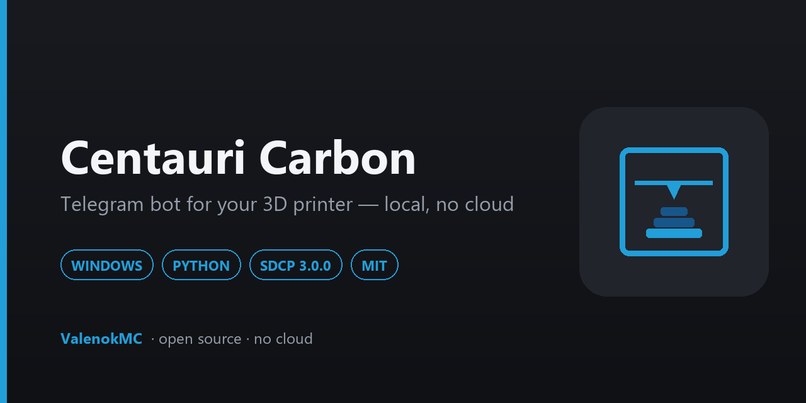
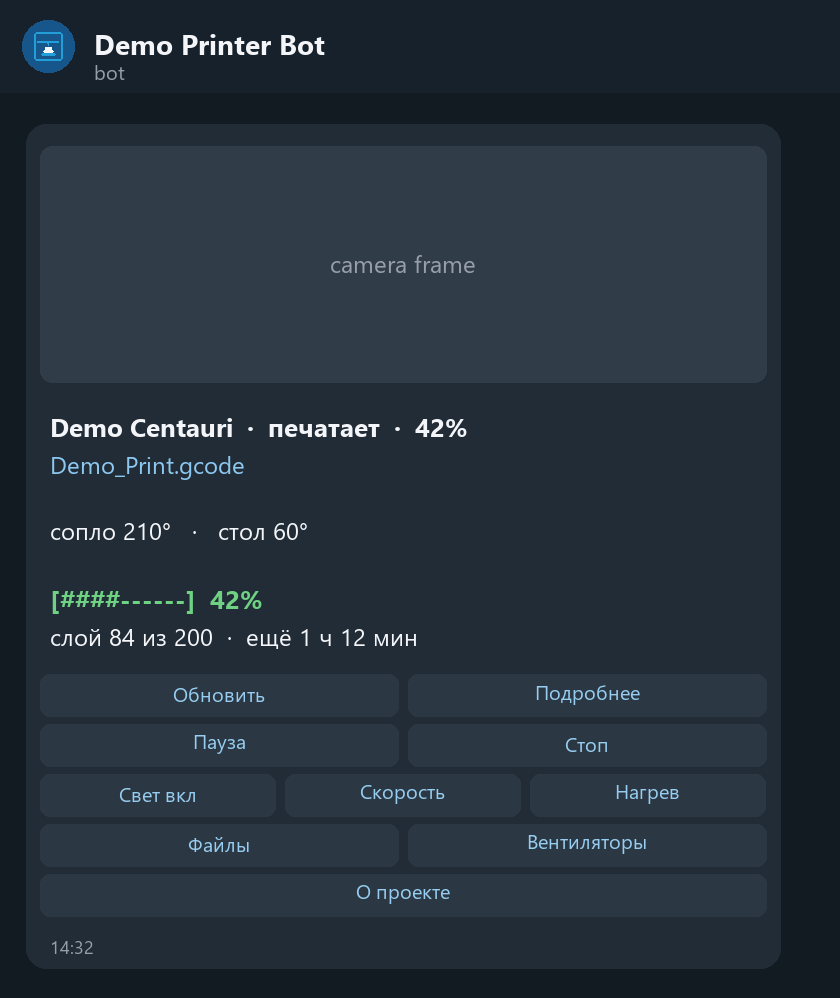

<div align="center">



# Centauri Carbon Telegram Bot

**Watch and control your Elegoo Centauri Carbon from Telegram — running on your own PC, with no server and no cloud.**

[](https://github.com/ValenokMC/Centauri-Carbon-Telegram-Bot/releases/latest)
[](https://github.com/ValenokMC/Centauri-Carbon-Telegram-Bot/releases)
[](https://github.com/ValenokMC/Centauri-Carbon-Telegram-Bot/actions)
[](#compatibility)
[](#requirements)
[](#compatibility)
[](LICENSE)
[](https://t.me/SupporBiBot?start=centauri_bot)

**English** · [Русский](README_RU.md)

[Changelog](CHANGELOG.md) · [Documentation](docs/installation.md) · [Support](SUPPORT.md) · [Telegram](https://t.me/SupporBiBot?start=centauri_bot) · [Support the author](https://web.tribute.tg/d/P54)

### [⬇ Download for Windows](https://github.com/ValenokMC/Centauri-Carbon-Telegram-Bot/releases/latest)

</div>

---

## Requirements

| | |
|---|---|
| **Operating system** | Windows 10 or 11 |
| **Python** | 3.9 or newer — [python.org](https://www.python.org/downloads/), tick *Add python.exe to PATH* |
| **Printer** | Elegoo Centauri Carbon (first generation), stock V1.4.x or OpenCentauri/COSMOS, on the same local network |
| **Anything else** | No. No server, no VPS, no cloud account, no third-party libraries. |

> [!IMPORTANT]
> **Centauri Carbon 2 is not supported.** It speaks a different protocol. This bot
> is written against SDCP 3.0.0 as used by the first-generation Centauri Carbon,
> and it has not been tested on any other printer. See [Compatibility](#compatibility).

---

## Screenshot

<div align="center">

</div>

One message. It is edited in place as the print advances, so the chat stays clean
and the buttons stay under your thumb.

---

## Why this project

A 3D print takes hours, and the two things you actually want to know are *is it
still going* and *did something go wrong*. Standing over the printer is not a
plan, and neither is opening a web interface every twenty minutes.

Most answers to this involve putting a printer on the internet, or signing up to
somebody's cloud. This one does not. It runs on the PC you already have, talks
to the printer over your own LAN, and sends you a message. Your token, your chat
id and your printer's address never leave your machine.

- **One message, not a flood.** The status message is edited in place. Buttons
  edit it too. Your chat does not fill up with a hundred near-identical updates.
- **It tells you when it matters.** Start, pause, resume, finish, stop, and a
  connection dropout that has lasted long enough to be real.
- **It knows the difference between finishing and being stopped.** The printer
  reports the same code for both; the bot uses the percentage reached.
- **Dangerous things ask first.** Stop and pause need a confirmation. So does
  starting a print — with a camera frame, so you can see the bed is clear.
- **Only you can use it.** Every update from any other chat is refused.

---

## Quick Start

1. **Get a token.** Open [@BotFather](https://t.me/BotFather) in Telegram, send
   `/newbot`, follow the prompts, copy the token it gives you.
2. **Download and unpack** the [Windows ZIP](https://github.com/ValenokMC/Centauri-Carbon-Telegram-Bot/releases/latest).
3. **Run `Setup.cmd`.** It checks Python, takes your token (without showing it),
   asks for the printer's address, tests both, and separately offers optional
   anonymous statistics. Declining changes nothing else.
4. **Press `/start`** in your new bot when the wizard asks. It finds your chat id
   by itself — no third-party "what is my id" bot involved.
5. **Run `Run.cmd`.** Send `/status` to your bot.

That is the whole setup. You never open a Python file, and you never type a chat
id by hand.

Optional: `Install-Autostart.cmd` starts the bot when you log in to Windows. It
shows you exactly what it will register and asks first; `Remove-Autostart.cmd`
removes it.

Full walkthrough: **[docs/installation.md](docs/installation.md)**

### Privacy

Anonymous statistics are off by default. If a person explicitly opts in, the
bot sends only a random installation id, the application version and project
code, at most once every 30 days. It sends no Telegram token or id, printer IP,
filenames, print status or images. Declining leaves the complete bot working.
Consent can be withdrawn by re-running `Setup.cmd`. Details: [PRIVACY.md](PRIVACY.md).

---

## Features

**Watching**

- Live status: state, file, progress, layer, time remaining, nozzle and bed
- A camera frame with the status, and `/snap` for one on demand
- Brief and detailed views — chamber temperature, fans, light, position
- Notifications: started · paused · resumed · finished · stopped · connection
  lost · connection restored
- Optional progress reports every *N* per cent
- Rail-lubrication reminder, counted from actual printing hours

**Controlling** *(optional — the wizard offers a monitoring-only mode)*

- Pause · resume · stop
- On COSMOS, exclude one failed model while the other objects keep printing
- Chamber light on and off, and an automatic switch-off at night after a print
- Print speed: 50 / 75 / 100 / 125 / 150 %
- Nozzle and bed heating presets
- All three fans, collected as a draft and sent in one command
- Browse the files on the printer and start one

The full list above applies to stock SDCP firmware. On COSMOS,
pause/resume/cancel and single-object exclusion share the job-control opt-in;
remote file start is enabled separately. Heater, fan, light, speed, macro and
arbitrary G-code controls stay unavailable until an installation-specific safe
mapping exists.

---

## Compatibility

| | Status |
|---|---|
| Elegoo Centauri Carbon (1st gen), firmware **V1.4.49** | ✅ Tested |
| Elegoo Centauri Carbon (1st gen), **OpenCentauri/COSMOS** | 🧪 Moonraker backend covered by automated tests; hardware validation pending |
| Other Centauri Carbon firmware | ⚠️ Likely fine, not tested |
| **Elegoo Centauri Carbon 2** | ❌ **Not supported** — different protocol |
| Any other printer | ❌ Not supported, not tested |
| Windows 10 / 11 | ✅ Tested |
| macOS, Linux | ⚠️ The Python code is portable; the launchers and autostart are not |

**Protocols:** stock firmware uses SDCP 3.0.0 over WebSocket on port 3030 and
MJPEG on 3031. COSMOS uses Moonraker's documented HTTP API. The stock command
codes are taken from the printer's own web interface, not guessed.

**Interface language:** Russian. The code, the documentation and the issue
templates are English. A full English UI is not written and not tested, and
shipping a half-translated interface would be worse than an honest single-language
one. If you want it, [say so in an issue](https://github.com/ValenokMC/Centauri-Carbon-Telegram-Bot/issues).

---

## Safety

> [!WARNING]
> **Do not forward the printer's ports to the internet.** SDCP has no
> authentication whatsoever. Anyone who can reach port 3030 can move your
> printer. This bot is built for a local network and nothing else.

- **Run one instance at a time.** Telegram allows exactly one long-polling
  consumer per token; a second one silently steals updates from the first.
- **Only the configured chat is obeyed.** Everything else gets refused.
- **The token never appears in a log.** Log lines are scrubbed on the way out,
  so a log is safe to attach to a bug report. Your `config.json` is not — never
  attach that.
- **Your data lives outside the program folder**, in
  `%LOCALAPPDATA%\CentauriCarbonTelegramBot\`, so re-extracting or updating the
  ZIP can never overwrite it.
- **A remotely started print is still a print.** You are telling a hot machine
  to run unattended. Check the camera frame the bot shows you.

More: [docs/security.md](docs/security.md) · [SECURITY.md](SECURITY.md)

---

## How it works

```
   Telegram  ⇄  bot (your PC/server)  ⇄  printer (your LAN)
             long polling           stock: SDCP WebSocket + MJPEG
                                    COSMOS: Moonraker HTTP + webcam
```

Four threads. One holds the printer's WebSocket and turns each status into
lifecycle events; one keeps that connection from going idle; one refreshes the
status message while a print runs; one long-polls Telegram for your button
presses. Everything the user owns is a small JSON file in `%LOCALAPPDATA%`,
written atomically.

Details: [docs/architecture.md](docs/architecture.md)

---

## Troubleshooting

| Symptom | Likely cause |
|---|---|
| `Python not found` | Python is not installed, or not on PATH. Reinstall and tick *Add python.exe to PATH*. |
| Wizard finds no chat id | You have not pressed `/start` in your own bot yet, or the token belongs to a different bot. |
| Port 3030 closed | Printer is off, on another network, or the address is wrong. Check it on the printer: Settings → Network. |
| Port 3031 closed | Camera is disabled. Everything else still works, without photos. |
| Buttons do nothing | A second copy of the bot is running and stealing the updates. |
| Two status messages | Was possible in older versions. Delete both; the bot makes a new one. |

Full guide: [docs/troubleshooting.md](docs/troubleshooting.md)

---

## Support

1. [Documentation](docs/installation.md)
2. [Discussions](https://github.com/ValenokMC/Centauri-Carbon-Telegram-Bot/discussions) — questions, ideas, showing off prints
3. [Issues](https://github.com/ValenokMC/Centauri-Carbon-Telegram-Bot/issues) — reproducible bugs
4. [@SupporBiBot](https://t.me/SupporBiBot?start=centauri_bot) — if GitHub is not for you

This is a one-person project. An answer may take a few days.
Read [SUPPORT.md](SUPPORT.md) before reporting — in particular, what not to send.

---

## Support the author

If the bot turned out to be useful, you can support its development:

<div align="center">

### [☕ Support on Tribute](https://web.tribute.tg/d/P54)

</div>

No feature is paid for, nothing is locked, nothing expires, and nothing is
measured. The bot mentions this at most once every 30 days, appended to a
message about a print that finished well — never on an error, never on a
warning, never twice.

---

## Development

```bash
git clone https://github.com/ValenokMC/Centauri-Carbon-Telegram-Bot.git
cd Centauri-Carbon-Telegram-Bot
python -m pip install -r requirements-dev.txt
python -m pytest tests/ -q
python tools/check_public_safety.py
```

The tests never open a socket, never talk to Telegram, and never write to your
real `%LOCALAPPDATA%` — there are tests that enforce each of those.

`tools/check_public_safety.py` refuses anything carrying private data. Run it
before you open a pull request; CI runs it too.

See [CONTRIBUTING.md](CONTRIBUTING.md) and [docs/architecture.md](docs/architecture.md).

---

## License and third-party components

[MIT](LICENSE) © ValenokMC.

The bot has **no third-party runtime dependencies** — the Python standard library
only. `pytest` is used for the test suite and is not shipped.
See [THIRD_PARTY_NOTICES.md](THIRD_PARTY_NOTICES.md).

Not affiliated with, endorsed by, or supported by Elegoo. "Elegoo" and "Centauri
Carbon" are used only to say which printer this works with.
